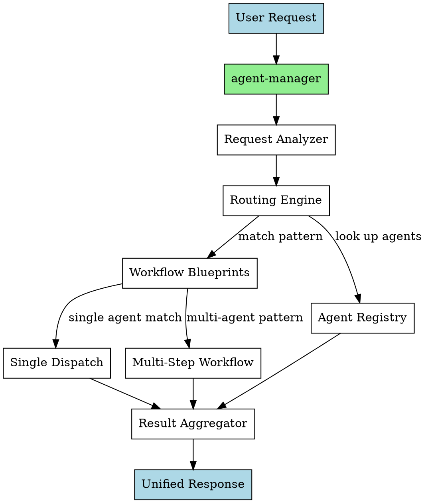

# Agent Manager — Orchestrator Subagent

## Overview

A meta-agent that routes requests to the right specialized subagent(s) — single dispatch or multi-step workflows. The user calls one agent (`agent-manager`), which analyzes intent, picks the right agents, dispatches them, and aggregates results.

## Motivation

The SkillPass project has 9 specialized subagents (bug-hunter, planner, go-scaffolder, react-scaffolder, test-runner, code-reviewer, security-auditor, db-migration, ui-ux-designer). Without an orchestrator, the user must know which agent to call for each task and manage multi-step workflows manually. The agent-manager eliminates that friction.

## Tech Stack

| Layer | Choice |
|---|---|
| Registration | `.opencode/agents/agent-manager.md` (opencode subagent) |
| Routing logic | Agent prompt instructions (Markdown) |
| Agent discovery | Dynamic — reads `.opencode/agents/*.md` frontmatter |
| Dispatch mechanism | `task` tool with `subagent_type` |
| Result aggregation | Inline in agent prompt instructions |

No code changes. This is a pure configuration/wiring project — new Markdown file, no application code.

---

## Architecture



### Components

- **Request Analyzer** — Parses the user's free-form request into action type, scope, and intent (bug fix, feature add, test run, code review, security audit, DB migration, planning, scaffolding, UI design)
- **Agent Registry** — Reads `.opencode/agents/*.md` files (excluding itself), extracts `name` and `description` from YAML frontmatter, builds an in-memory routing table
- **Workflow Blueprints** — Named patterns for common multi-agent scenarios (see below). The analyzer picks a pattern or falls back to single-agent routing
- **Routing Engine** — Matches analyzed request against agent descriptions and blueprint patterns to determine which agent(s) to dispatch and in what order
- **Result Aggregator** — Collects outputs from dispatched agents, labels them by agent name, and presents a unified response

### Data Flow

1. User calls `task` tool with `subagent_type: "agent-manager"` and their request as the prompt
2. Agent-manager reads `.opencode/agents/*.md` files (excluding itself) to build the agent registry
3. Analyzes the request: action type, domain, scope
4. Matches against workflow blueprints first, then falls back to single-agent matching
5. For single dispatch: calls `task` tool with the matched agent type and the user's request
6. For multi-step: calls agents sequentially (or parallel where safe), passing context between steps
7. Aggregates all results into one response labeled per agent
8. Returns the unified response to the user

---

## Request Analysis & Routing

### Dimensions

| Dimension | Values | Example |
|---|---|---|
| Action type | bug_fix, feature_add, test_run, code_review, security_audit, db_migration, planning, scaffolding, ui_design | "registration error" → bug_fix |
| Domain | auth, api, db, frontend, ui, config, devops, general | "new endpoint" → api |
| Scope | single_file, cross_cutting, workflow | "add login page" → workflow |
| Urgency | diagnose_first, implement_directly | "getting errors" → diagnose_first |

### Agent Matching

Match request keywords against agent descriptions from frontmatter. Examples:

| Request keywords | Matched agent |
|---|---|
| bug, error, crash, fails, broken, issue | bug-hunter |
| review, PR, merge, code quality | code-reviewer |
| migration, schema, table, column, DB | db-migration |
| scaffold, handler, endpoint, route, middleware | go-scaffolder |
| plan, design, approach, how to implement | planner |
| component, page, hook, react, frontend | react-scaffolder |
| audit, security, vulnerability, auth, CORS | security-auditor |
| test, run tests, failing test, coverage | test-runner |
| ui, design, layout, style, look and feel | ui-ux-designer |

When no clear match is found, the agent-manager asks the user for clarification rather than guessing.

---

## Workflow Blueprints

### Sequential Patterns

| Request Pattern | Blueprint | Notes |
|---|---|---|
| New feature / endpoint | `planner` → ( `go-scaffolder` \| `react-scaffolder` ) → `test-runner` | Plan first, then scaffold, then test |
| Bug report | `bug-hunter` → `code-reviewer` | Find bugs first, then review fixes |
| Security audit | `security-auditor` → `code-reviewer` | Audit first, then review changes |
| DB schema change | `db-migration` → `test-runner` | Create migration, then verify |
| UI/UX feature | `planner` → `ui-ux-designer` → `react-scaffolder` → `test-runner` | Plan, design, build, test |

### Parallel Patterns

| Request Pattern | Blueprint | Notes |
|---|---|---|
| Investigate failure | `bug-hunter` + `test-runner` | Hunt bugs and run tests concurrently |
| Security incident | `security-auditor` + `bug-hunter` | Audit and hunt concurrently |

### Step Context Passing

Each step in a sequential workflow receives:
- Original user request
- Output from all previous steps (accumulated context)
- Any files created/modified by previous steps

This lets later agents (like `test-runner`) know what earlier agents (like `go-scaffolder`) created.

---

## Result Aggregation

### Format

```
── Agent Manager ──────────────────────

Step 1: <agent-name>
  Status: completed | skipped | failed
  Output: <agent's returned output>

Step 2: <agent-name>
  Status: completed | skipped | failed
  Output: <agent's returned output>
```

### Edge Cases

| Scenario | Behavior |
|---|---|
| No agent matches | Ask user for clarification |
| Agent fails/dispatches nothing | Report failure, continue remaining steps (if independent) |
| All agents fail | Report all failures, suggest next steps |
| Single dispatch | Return result directly (no wrapper needed for trivial cases) |

---

## File Structure

### Create

- `.opencode/agents/agent-manager.md` — Agent definition and instructions (routing logic, blueprints, aggregation)

### No Changes

- `opencode.json` — Stays as-is (agents auto-discovered from `.opencode/agents/`)
- Any application code, skills, or config files

---

## Testing

Test by calling the agent-manager with various request types and verifying correct dispatch:

| Test case | Expected behavior |
|---|---|
| "find bugs in the auth handler" | Dispatches bug-hunter only |
| "we need a new API endpoint for teams" | Dispatches planner → go-scaffolder → test-runner |
| "run tests and check for security issues" | Dispatches test-runner + security-auditor in parallel |
| "make me a coffee" | Asks for clarification (no match) |
| "review the PR" | Dispatches code-reviewer only |

---

## Open Questions

None. All design decisions were validated during brainstorming.
